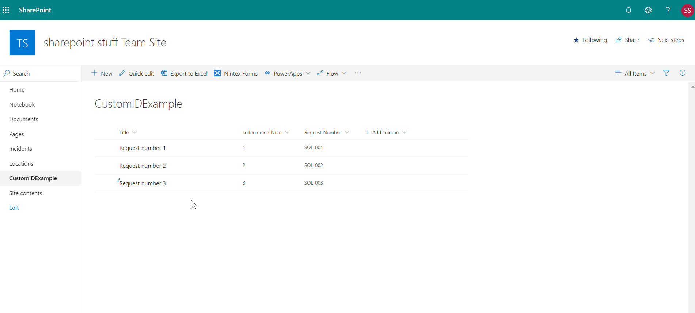

# Custom ID example solution
This example solution populates a custom ID field when a new item is added to a SharePoint Online list.

## Applies to

* [SharePoint](https://github.com/SharePoint)

## Solution

Solution|Author(s)
--------|---------
Custom ID example|Anthony Tudor (@sharepointstuff)

## Version history

Version|Date|Comments
-------|----|--------
1.0|December 24, 2019|Initial release

## Disclaimer
**THIS CODE IS PROVIDED *AS IS* WITHOUT WARRANTY OF ANY KIND, EITHER EXPRESS OR IMPLIED, INCLUDING ANY IMPLIED WARRANTIES OF FITNESS FOR A PARTICULAR PURPOSE, MERCHANTABILITY, OR NON-INFRINGEMENT.**

---

## Install steps

### Upload list template

- Save both the list template and Flow zip file locally
- In your SharePoint site, click the cog button > Site information > View all site settings
- Under Web Designer Galleries > List templates
- On the ribbon, click Upload Document
- In the Add a Template page, press browse to navigate to the list template downloaded earlier
- Press OK

### Import Flow

- Press the import button in the top right hand corner of the screen on the My Flows homepage
- Next, upload the package file and wait for the screen to show up the package details
- When configuring the flow settings, you can choose to either create a new flow or update an existing one with the flow definition from the package
- You will also need to select the connections that are required to setup the flow as part of the import process. You should see the
- Import button light up once you have successfully configured all the required settings

